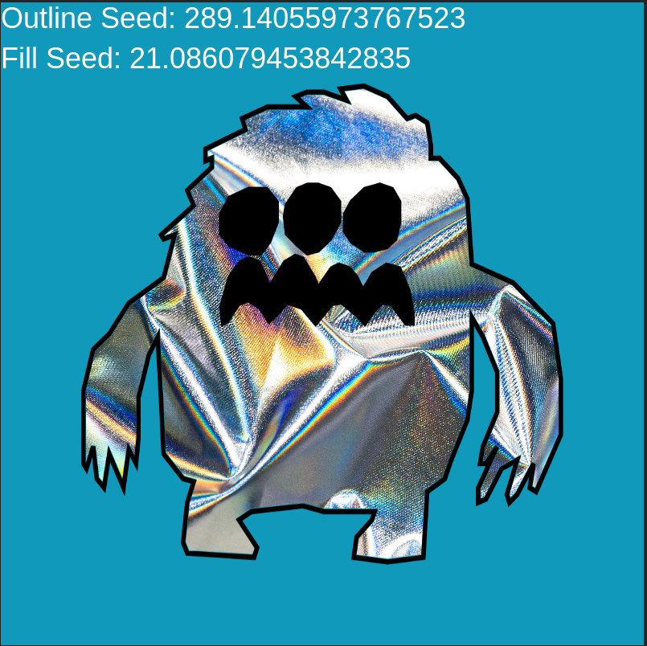

# Real Pets Proof of Concept

Real Pets was an attempt to see if I could make procedurally generated background fills for characters that I made.

## Process

- Create an outline in whatever SVG creator you desire (Figma, etc)
- Invert your SVG and get a background fill
- Create a face SVG to overlap
- Find an image that you would like to fill the background of the outline

## Examples

